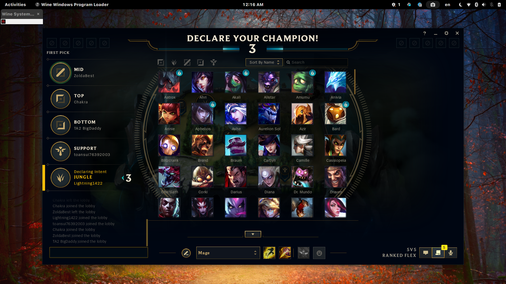

# Note: This is the way I personally use to start LOL on Linux, through lutris. The code for starting game without Lutris is still in the script though
## Wine Dependency (Maybe redundant, but just to be sure nothing goes wrong)
**Source:** [https://www.gloriouseggroll.tv/how-to-get-out-of-wine-dependency-hell/](https://www.gloriouseggroll.tv/how-to-get-out-of-wine-dependency-hell/)

### Antergos/Manjaro/Arch derivatives (enable multilib in pacman.conf):
```
sudo pacman -Sy
sudo pacman -S wine-staging winetricks
sudo pacman -S giflib lib32-giflib libpng lib32-libpng libldap lib32-libldap gnutls lib32-gnutls mpg123 lib32-mpg123 openal lib32-openal v4l-utils lib32-v4l-utils libpulse lib32-libpulse alsa-plugins lib32-alsa-plugins alsa-lib lib32-alsa-lib libjpeg-turbo lib32-libjpeg-turbo libxcomposite lib32-libxcomposite libxinerama lib32-libxinerama ncurses lib32-ncurses opencl-icd-loader lib32-opencl-icd-loader libxslt lib32-libxslt libva lib32-libva gtk3 lib32-gtk3 gst-plugins-base-libs lib32-gst-plugins-base-libs vulkan-icd-loader lib32-vulkan-icd-loader cups samba dosbox
```
### Solus:
```
sudo eopkg install wine wine-devel wine-32bit-devel winetricks
```
### Ubuntu:
```
wget -nc https://dl.winehq.org/wine-builds/winehq.key
sudo apt-key add winehq.key
sudo apt-add-repository 'https://dl.winehq.org/wine-builds/ubuntu/'
sudo apt update
sudo apt install --install-recommends winehq-staging
sudo apt install winetricks
```
### Fedora (<34), Fedora 34 switch to pipewire instead of pulseaudio by default, I don't use Fedora so not sure:
```
sudo dnf install alsa-plugins-pulseaudio.i686 glibc-devel.i686 glibc-devel libgcc.i686 libX11-devel.i686 freetype-devel.i686 libXcursor-devel.i686 libXi-devel.i686 libXext-devel.i686 libXxf86vm-devel.i686 libXrandr-devel.i686 libXinerama-devel.i686 mesa-libGLU-devel.i686 mesa-libOSMesa-devel.i686 libXrender-devel.i686 libpcap-devel.i686 ncurses-devel.i686 libzip-devel.i686 lcms2-devel.i686 zlib-devel.i686 libv4l-devel.i686 libgphoto2-devel.i686 cups-devel.i686 libxml2-devel.i686 openldap-devel.i686 libxslt-devel.i686 gnutls-devel.i686 libpng-devel.i686 flac-libs.i686 json-c.i686 libICE.i686 libSM.i686 libXtst.i686 libasyncns.i686 liberation-narrow-fonts.noarch libieee1284.i686 libogg.i686 libsndfile.i686 libuuid.i686 libva.i686 libvorbis.i686 libwayland-client.i686 libwayland-server.i686 llvm-libs.i686 mesa-dri-drivers.i686 mesa-filesystem.i686 mesa-libEGL.i686 mesa-libgbm.i686 nss-mdns.i686 ocl-icd.i686 pulseaudio-libs.i686 sane-backends-libs.i686 tcp_wrappers-libs.i686 unixODBC.i686 samba-common-tools.x86_64 samba-libs.x86_64 samba-winbind.x86_64 samba-winbind-clients.x86_64 samba-winbind-modules.x86_64 mesa-libGL-devel.i686 fontconfig-devel.i686 libXcomposite-devel.i686 libtiff-devel.i686 openal-soft-devel.i686 mesa-libOpenCL-devel.i686 opencl-utils-devel.i686 alsa-lib-devel.i686 gsm-devel.i686 libjpeg-turbo-devel.i686 pulseaudio-libs-devel.i686 pulseaudio-libs-devel gtk3-devel.i686 libattr-devel.i686 libva-devel.i686 libexif-devel.i686 libexif.i686 glib2-devel.i686 mpg123-devel.i686 mpg123-devel.x86_64 libcom_err-devel.i686 libcom_err-devel.x86_64 libFAudio-devel.i686 libFAudio-devel.x86_64
```

```
sudo dnf groupinstall "C Development Tools and Libraries"
sudo dnf groupinstall "Development Tools"
```
```
sudo dnf install wine
```
## Install Lutris
**Follow Lutris official docs here:** [https://lutris.net/downloads/](https://lutris.net/downloads/)

## Install Garena and LOL from Lutris
**Garena:** [https://lutris.net/games/garena/](https://lutris.net/games/garena/)

**Note for Garena:** After installing Garena, do not login, close the window

**LOL:** [https://lutris.net/games/league-of-legends/](https://lutris.net/games/league-of-legends/)

**Note for LOL:** when the installer for LOL NA comes up, just close it, you don't need to install it, we just need the environment

## Install LOL from Garena
Open Garena from lutris and install LOL like you normally do on Windows. 

Also, enable **Disable proxy when browsing** for better Garena experience (it sucks)


## Config LOL Lutris
Change the Executable in LOL to **RiotClientServices.exe** from the LOL-Garena installed location. For example:

> /home/nhubao/Games/league-of-legends/drive_c/Games/32787/Riot Client/RiotClientServices.exe


## Start the game
* Download the python script (lol.py)
* Install the dependencies:
```
pip3 install psutil pyyaml glob
```
* Start Garena
* Open terminal and run the script
```
python3 lol.py
```
* Wait for a while, it may take long

# Result
